# ESE 350 Group 14 Blog
## Final Demo Video
Link - https://vimeo.com/369928942

## Public Demo Day
May 9th

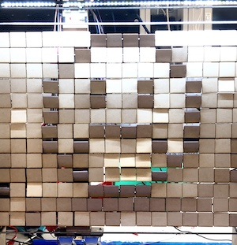


On Public Demo Day we finally closed the loop and got our camera integrated into our project. We used OpenCV with an API to achieve smile detection, that wrote whether or not a smile was detected to a .txt in our Final Project folder. We were then able to check in our c code whether a smile had been detected or not and use that information to determine the image that was displayed on our screen. If a smile was detected our screen would display a smile(pictured left), and if not it would display a frown(pictured right). With that we had finally reached our reach goal of integrating the camera in an interactive way into our system! 
```markdown
	system("sudo modprobe bcm2835-v4l2");
	system("python3 smile_detection.py");	//run smile detection software
	sleep(10);				//wait for smile to be detected
	
	FILE *file;
	file = fopen("smile.txt", "r");		//open smile text file
	if (file) {
		fseek(file, 0, SEEK_END);
		int size = ftell(file);
		if (size != 0){			//check if file is not empty == smile detected
			smiledetect = 1;
			} else {
			smiledetect = 0;	//if file is empty no smile was detected
			}
	fclose(file);
	}
	
	for(int i =0; i < 12; i++){
		for(int j = 0; j < 14; j++){
			if (smiledetect){
			gpioServo(j+2, smiley[i][j]);  	//draw smile if smile detected
			}
			else{
			gpioServo(j+2, frowny[i][j]);	//draw frown otherwise
			}
			usleep(10000);
			}
		sleep(1);
         
	 	for(int k =0; k < 14; k++){
			gpioServo(k+2, 2500);		//reset each servo
			usleep(10000);
			}
		if(i == 11){
			break;
			}
		sleep(1);
		stepperRight(4018);			//move over the servo arm to the next column
	 	sleep(1);
      	}	
      stepperLeft(45025);				//return servo arm to original position when image is finished
}
```
## Class Demo Day
May 4th

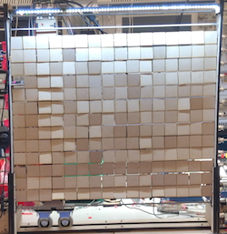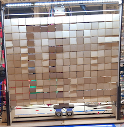

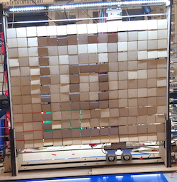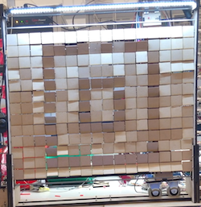

For the class demo we were able to finally get our project working, set up the led, and were finally able to successfully display configured patterns and designs on our wodden tile screen. In order to communicate the picture information to our servos, we used a 2d array(this is the 2d array for the images pictured above), 
```markdown
int boxbox[12][14] = {  
   {2500, 2500, 2500, 2500, 2500, 2500, 2500, 2500, 2500, 2500, 2500, 2500, 2500, 2500} , 
   {2500, 2500, blck, blck, blck, blck, blck, blck, blck, blck, blck, blck, blck, 2500} , 
   {2500, 2500, blck, 2500, 2500, 2500, 2500, 2500, 2500, 2500, 2500, 2500, blck, 2500} , 
   {2500, 2500, blck, 2500, 2500, 2500, 2500, 2500, 2500, 2500, 2500, 2500, blck, 2500} , 
   {2500, 2500, blck, 2500, 2500, blck, blck, blck, blck, blck, 2500, 2500, blck, 2500} , 
   {2500, 2500, blck, 2500, 2500, blck, 2500, 2500, 2500, blck, 2500, 2500, blck, 2500} , 
   {2500, 2500, blck, 2500, 2500, blck, 2500, 2500, 2500, blck, 2500, 2500, blck, 2500} , 
   {2500, 2500, blck, 2500, 2500, blck, blck, blck, blck, blck, 2500, 2500, blck, 2500} , 
   {2500, 2500, blck, 2500, 2500, 2500, 2500, 2500, 2500, 2500, 2500, 2500, blck, 2500} , 
   {2500, 2500, blck, 2500, 2500, 2500, 2500, 2500, 2500, 2500, 2500, 2500, blck, 2500} , 
   {2500, 2500, blck, blck, blck, blck, blck, blck, blck, blck, blck, blck, blck, 2500} , 
   {2500, 2500, 2500, 2500, 2500, 2500, 2500, 2500, 2500, 2500, 2500, 2500, 2500, 2500} , 
}
;
```
and in the code we iterated through column by column, telling the servos how much to move and in what positions to create the image. Between calls to each column we had the stepper motor move a fixed distance to the next column using the following code:
```markdown
      for(int i =0; i < 12; i++){
         for(int j = 0; j < 14; j++){
	 	gpioServo(j+2, smiley[i][j]);		//print one column of the image
		usleep(10000);
		}
		sleep(1);
		
	for(int k =0; k < 14; k++){
		gpioServo(k+2, 2500);			//reset each servo
		usleep(10000);
		}
		sleep(1);
		stepperRight(4018);			//move the stepper motor over to the next column
		sleep(1);
	}
	stepperLeft(45025);				//move back to the starting image once all the columns are complete
```
In this way we finally achieved our vision of creating a functioning tile display screen. We were also able to take photos with our camera, but hadn't had time to integrate it into the program.
## Week 4 - Finishing building our system
April 28th - May 3rd

Holy moly. Finishing up the building of this project took way way way longer than we could have expected. We spent over 15 hours a day all week, including 30 hours straight in the lab without leaving to finish up our project in time for demo day. To create our tiles we needed to glue a nylon spacer onto the center of each tile. To do this we laser cut a mold that would fit the tile and had a hole in the middle for a dab of hot glue and the spacer. Individually putting together the tiles took around 5 hours of straight arduous work, our fingers started to feel like we were getting arthritis by the end of it. 

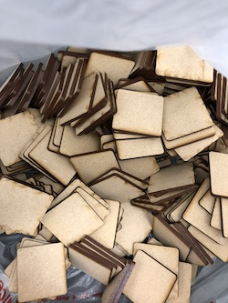 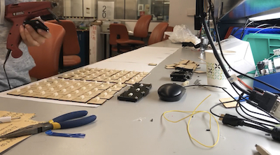

Once the tiles were made, setting them up on the bars was a whole other project that took another 6-7 hours as each tile needed exactly the right amount of tape on the bars to cause enough friction for the tiles to be able to tilt freely, while also staying in place at whatever angle they were tilted to. Finding this balance was very difficult and unique to each tile, but eventually, through sheer will, we were able to get it done. 

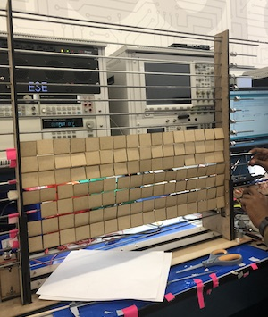 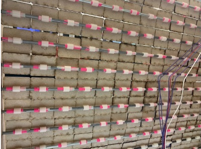

Once the physical system was done being built, we set up the stepper motor using a timing belt and bores attached to our moving 16 servo high arm, and attached all of the wires from the servos and the stepper mototrs to the raspberry pi. And finally, our project was ready for testing/debugging. Luckily for us, we saw very promising results on its very first run, but we still have a lot to go to reach our final goals for the project.

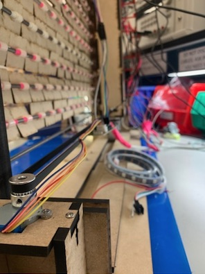
## Week 3 - Milestone 2, scaling up
April 21st - April 27th

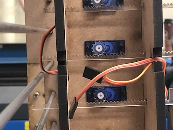 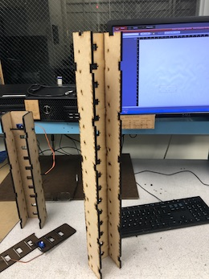 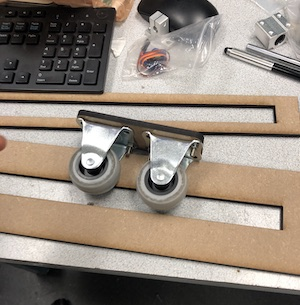

For our second milestone we started thinking ahead towards our final system. The solution to our tile issue we came up with was a moving arm that was 16 servos high to reach all of the tiles in a given column. This arm would be able to move left to right in order to reach every column. In order for the servos to be able to push each individual tile. We created a rack and pinion that we could attach onto each servo head, and achieve linear, instead of circular, motion to push the tiles. We created a large casing for the arm, screwed in the 16 servos and attached the gears, and then created a track for it at the bottom of our system that it would move left and right in. We also created stands for the tiles and set up 16 metal bars that the tiles will eventually be placed on.

## Week 2 - Milsetone 1, building a small scale model
April 14th - April 20th

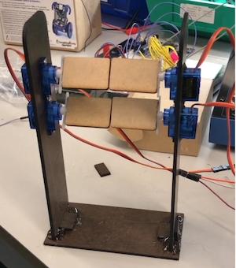

Having moved on from the electromagnet idea, we moved back to our initial idea of using servos to tilt the tiles. We built a mini 2x2 system where each tile was fixed to a servo and able to tilt. Using some basic python code, we were able to get the tiles to tilt in real time and create various shades of light and dark, however, we know for the actual project we will not be able to have a servo attached to each and every tile, because that would be far too expensive. So, we are still thinking of a way to be able to reach all 256 tiles.
## Week 1 - Testing out viability of electromagnet
April 7th - April 13th

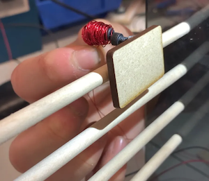

One of the big things we want for this project is for it to be able to work in real-time. This would allow us to read in camera information and display images that would mirror real life and move like a tv screen. In order for us to get our 16x16 grid that we wanted(256 pixels), we knew we couldn't buy 256 servos because it would simply be too expensive. So another idea we had was to use electromagnets to move the tiles in real time. We tested out electromagnets using various materials and copper wire, but we came to a big issue. As the electromagnets got stronger and more viable to be used in our project, they also became a lot hotter and harder to make. We couldn't get the electromagnets to a place where they were strong enough to reliably tilt tiles before causing a mini fire in Detkin. So after several days of working on this idea, we ended up having to scrap it.

## Project Proposal
Our final project is a light art installation designed for the ESE department. The final
product will consist of a grid of wooden tiles with a nearby light source shining down on them from
above, composing a grayscale portrait of anyone who walks by. Each individual tile will act as a pixel by
reflecting the light from the source via individually controlled servo motors or electromagnets designed to
tilt each tile; tilting up and facing the light source would be seen as “white” while tilting down and being
completely shaded would be seen as “black”. A camera installed in the front of the setup would capture in
real-time images of users standing in front of the installment and would interactively redraw them via the
tiles.
