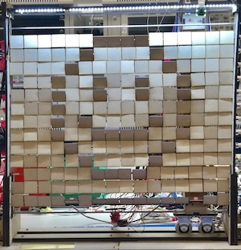

# ESE 350 Group 14 Blog
## Final Demo Video
Link - https://www.youtube.com/watch?v=NKJDuv7oGUY

## Public Demo Day
05/09/19



On Public Demo Day we finally closed the loop and got our camera integrated into our project. We used OpenCV to 
## Class Demo Day
05/04/19
For the class demo we were able to finally get our project working. Able to successfully display configured patterns and designs on our wodden tile screen. We were also able to take photos with our camera, but hadn't integrated it into the program.
## Week 2 - building 

## Week 1 - testing out viability of electromagnet


### Markdown

Markdown is a lightweight and easy-to-use syntax for styling your writing. It includes conventions for

```markdown

```
